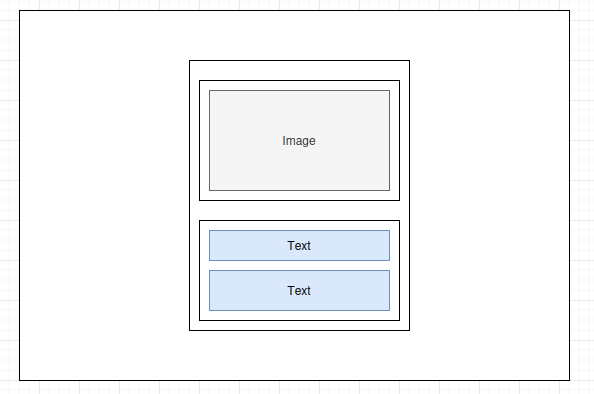

# Frontend Mentor - QR code component solution

This is a solution to the [QR code component challenge on Frontend Mentor](https://www.frontendmentor.io/challenges/qr-code-component-iux_sIO_H).

## Table of contents

- [Overview](#overview)
  - [Screenshot](#screenshot)
- [My process](#my-process)
  - [Built with](#built-with)
  - [What I learned](#what-i-learned)
  - [Continued development](#continued-development)
  - [Useful resources](#useful-resources)
- [Author](#author)

## Overview

### Screenshot

## My process

First, I sectioned the design into boxes. Based off those boxes, I created the HTML structure.
I had to review my notes when trying to position the card in the centre.

### Built with

- HTML
- CSS
- Flexbox

### What I learned

- Learned to structure content using semantic HTML.
- Learned to use CSS variables.
- Learned to use CSS resets.
- Learned to use box sizing
- Learned the very basics of Flex, although I need to review it.
- Learned to center an element by setting a `max-width` and setting left and right margins to `auto`.
- Learned to center an element using Flex.
- Learned to use `vh` length to fill an element in the viewport. 1vh

### Continued development

I don't fully understand Flex or layouts in general. I'm also not fully comfortable with assigning measurements to elements.

### Useful resources

- [Shay Howe - Learn HTML & CSS](https://learn.shayhowe.com/html-css/)
- [Flexbox In 8 Minutes - YouTube](https://www.youtube.com/watch?v=phWxA89Dy94)

## Author

- Frontend Mentor - [@yourusername](https://www.frontendmentor.io/profile/henrychris)
- Twitter - [@hiddenhenry](https://www.twitter.com/hiddenhenry)
